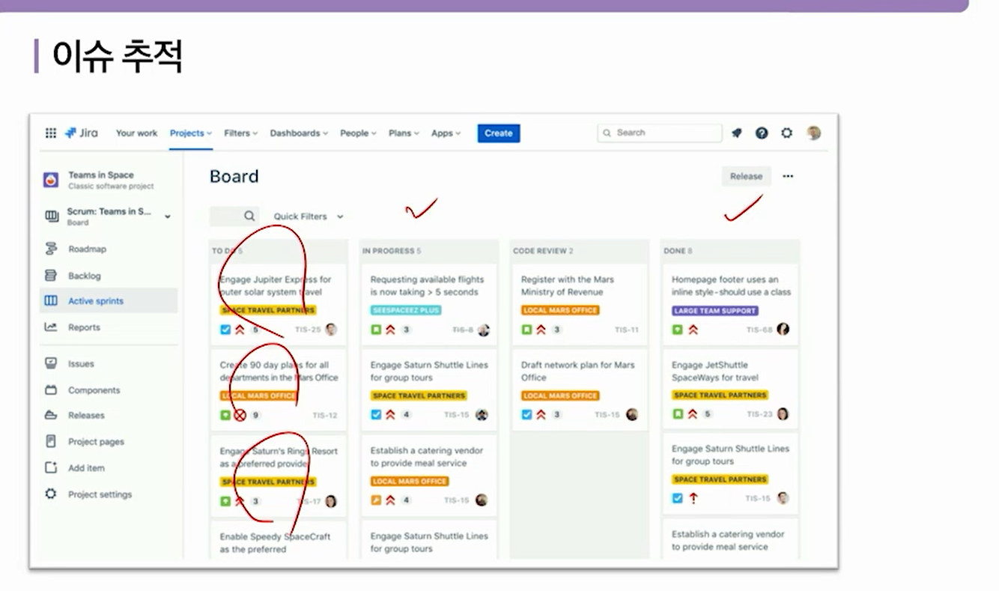

# JIRA

## JIRA 가 뭐야?

jira는 이슈 트랙킹 시스템 중 하나로 인기 많음

요새 JIRA가 더 중요해지는 이유로는 DevOps(운영)팀과 협력이 가능해짐

개발팀과 DevOps 팀들간의 커뮤니케이션에 도움을 줌. 요새 같이 애자일이 중요해지는 시기일수록 서로간의 대화가 중요해짐

## 이슈 관리

Epic: 하나의 큰 틀?(유저 관리)

STORY: 로그인 / sub-task ?

TASK: 로그인을 하기 위해 할일(로그인창 개발, 회원가입 등등)

BUG: 말 그대로 BUG

epic > story > sub-task 

Assign: 담당자

Status: Todo / progress / Done - 세부화할 수 있음

Components: Backend / Frontend / DevOps  

## JIRA의 언어 JQL

### ISSUE 검색

이렇게 하는게 기본 검색이고 더 고급은 Advanced 클릭하면 직접 쿼리로 검색가능

### JQL 연산자

### 날짜 (어제 이후 수정된 이슈 검색)

### 키워드

### 함수

endOfday: 저녁12시

startOfDay: 아침

endofWeek: 토요일 startofWeek: 일요일

currentLogin: 지금 Login 했을때 변경된 것들

currentUser: 내가 변경한것들

내가 검색한 걸 저장해서 편하게 Filter로 사용할수도 있음

아직 안끝나고 내가 담당자인거 검색(status는 인간, resolution이 쿼리검색시 판단)

## 나만의 대쉬보드 만들어서 관리하기

대쉬보드 만들고 가젯 만들어서 추가하기

Assigned to me(나의 미완료 이슈 를 나타내주는 가젯), Filter Results, heat map, pie chart, 

파이차트(만든 필터, components 별로 나눠줄수 있음)

### Agile Board

스크럼보드(Backlog는 전체 할일, sprint는 기능별 할일? 이 정도로 나뉘면 될듯)는 프로젝트 이슈 기준으로 생성된 화면의 board이고 kanban 보드는 필터를 기준으로 만들어주는 board임

## 현업에서의 jira 활용

DevOps에서 JIRA는 정말 많이 쓰임

스마트 커밋 기능? -지라를 통해 깃헙, 깃랩도 관리 가능함

경험해봐야 할 플러그인?: 

나중에 export하면 csv나 깃허브같은데로 migration 할 수 있음

